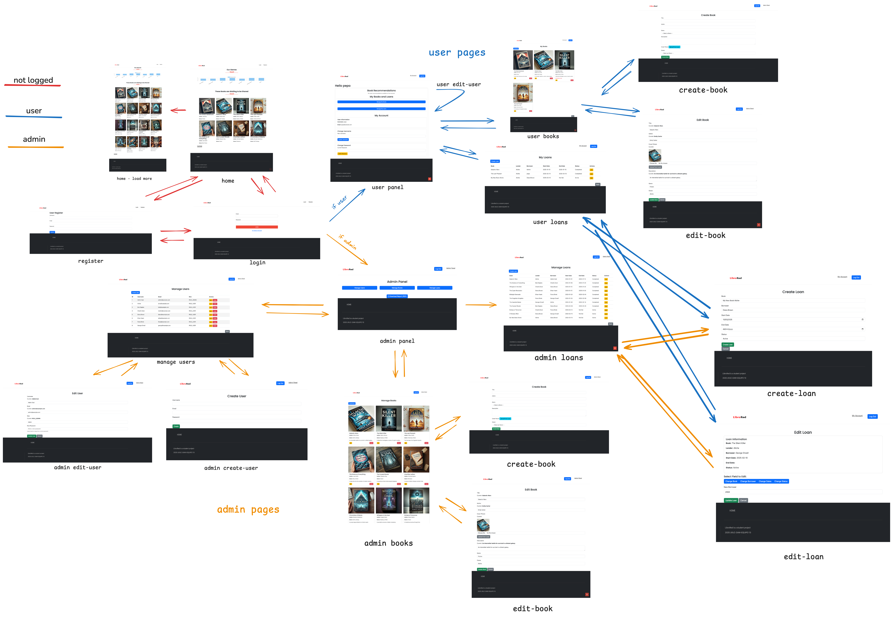
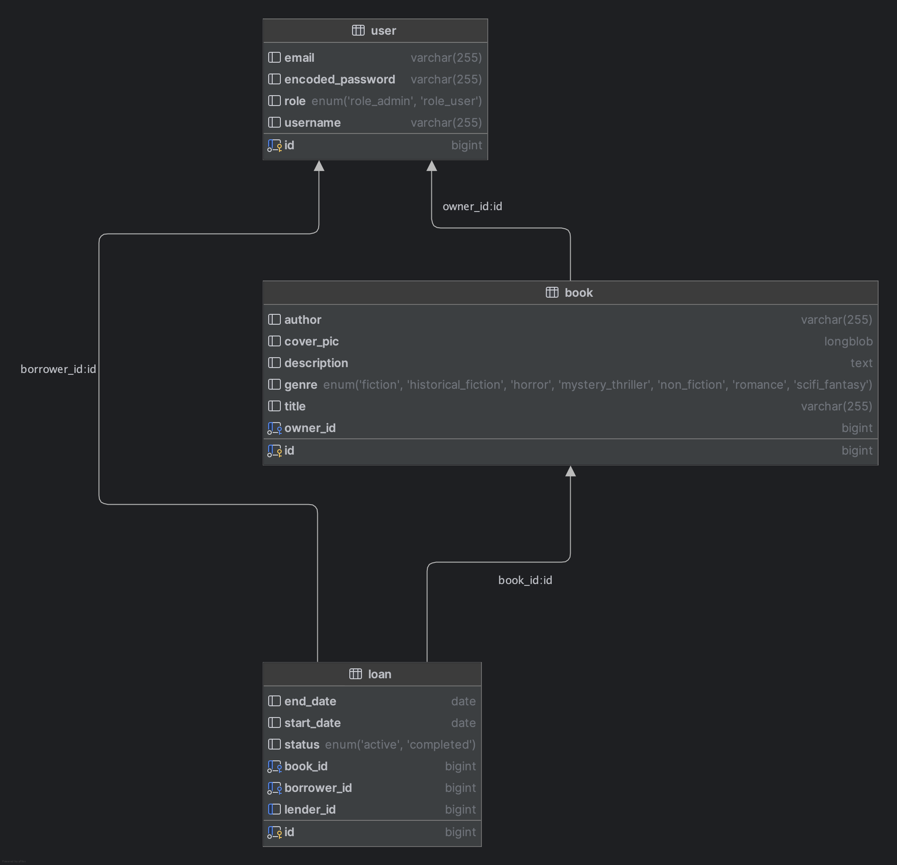
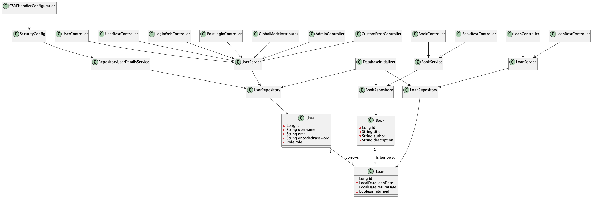

# 📚 LibroRed - Web Application for Book Lending Between Individuals

---

## Development Team Members (Team 13)

- **First Name**: Ana María
- **Last Name**: Jurado Crespo
- **Official University Email**: [am.juradoc@alumnos.urjc.es](mailto:am.juradoc@alumnos.urjc.es)
- **GitHub Account**: [medinaymedia](https://github.com/medinaymedia)

---

## Application Description

### 1️⃣ Application Entities

#### User
Represents the platform's users, who can be **lenders** and/or **borrowers**.
- A **lender** is a user who has books available for lending.
- A **borrower** is the person who receives a book on loan.  
  There are three types of users: **Anonymous, Registered, and Admin**.

#### Book
Represents the books available for lending.

#### Loan
Represents the process of borrowing a book between two users.

#### 🔗 Relationships Between Entities

- **User ↔ Book**: A user can have multiple books available for lending.
- **User ↔ Loan**: A loan connects two users: the **lender** (owner of the book) and the **borrower** (who receives the book).
- **Loan ↔ Book**: Each loan is associated with a specific book.

---

### 2️⃣ User Permissions

- **Anonymous User**: Can browse basic information about available books but cannot request loans or create books.
- **Registered User**: Can offer books for lending, request loans. They manage their own books and loans.
- **Administrator User**: Has full control over the platform, including user, loan and book management.

---

### 3️⃣ Images

- **Book**: Each book will have a single associated cover image.

---

### 4️⃣ Graphs

Each user will be able to view:

** Books by Genre Graph**: A bar chart representing the number of books available in each genre.

---

### 5️⃣ Additional Features

** PDF Export of Database Information for Admins**  
Generates a PDF containing details of **Users, Books, and Loans**.

---

### 6️⃣ Advanced Algorithm

** Book Recommendation Algorithm**

#### How It Works
1. **User's Book Preferences Analysis**: Identifies the genres of books registered by the user.
2. **User's Loan History Analysis**: Identifies the genres of books the user has borrowed.
3. **Recommendation Generation**: The system suggests books aligned with the user's interests.

---

### 7️⃣ New Features (P2)

#### REST API Integration
- **Complete REST API**: Full CRUD operations for Users, Books, and Loans
- **JWT Authentication**: Secure API access with JSON Web Tokens
- **OpenAPI/Swagger Documentation**: Interactive API documentation at `/swagger-ui.html`
- **Multiple Authentication Methods**: Supports both session-based (web) and token-based (API) authentication

#### Health Monitoring & Observability
- **Spring Boot Actuator**: Health monitoring endpoints at `/actuator/health` and `/actuator/info`
- **Database Health Checks**: Automatic database connectivity monitoring
- **Application Status**: Real-time application health status reporting

#### Enhanced Security Features
- **Auto-logout on Account Deletion**: When an admin deletes their own account, the system automatically logs them out
- **Email-based Authentication**: Users authenticate using their email address instead of username
- **Role-based Access Control**: Enhanced permission system for API endpoints
- **CSRF Protection**: Cross-site request forgery protection for web endpoints

#### Docker Support
- **Multi-stage Docker Build**: Optimized containerization with Maven and OpenJDK
- **Docker Compose Orchestration**: Complete development environment with MySQL database
- **Health Check Integration**: Container health monitoring with automatic restarts
- **Port Mapping**: MySQL on port 3307 to avoid conflicts with local installations

#### API Documentation
- **Comprehensive Endpoint Coverage**: All user, book, and loan operations documented
- **Request/Response Examples**: Detailed API usage examples and schemas
- **Authentication Flows**: Complete JWT authentication workflow documentation
- **Error Handling**: Standardized error responses and status codes

#### Enhanced Validation
- **Advanced Loan Validation**: Complex business rules for loan creation and editing
- **Date Validation**: Smart date range checking for loan periods
- **Book Availability**: Real-time availability checking to prevent conflicts
- **User Ownership**: Strict ownership validation for book and loan operations

---

# Application

## Navigation Diagram


[Link to Exaclidraw](https://excalidraw.com/#json=630FFVgKYQWqjaHvjUj_Y,McZxkSjNhwxS2j8aCc2-mw)

## DB Entity Diagram

Here is the entity diagram image of librored DB



## Structured Class Diagram (updated)




---
# How to Configure your Environment (MacOs)
To configure and run the Spring Boot application in a completely new environment on macOS, follow these detailed instructions:

### 1. Install Homebrew
Homebrew is a package manager for macOS that simplifies the installation of software.

```sh
/bin/bash -c "$(curl -fsSL https://raw.githubusercontent.com/Homebrew/install/HEAD/install.sh)"
```

### 2. Install Java Development Kit (JDK)
Install the latest version of OpenJDK.

```sh
brew install openjdk
```

Add the JDK to your PATH:

```sh
echo 'export PATH="/usr/local/opt/openjdk/bin:$PATH"' >> ~/.zshrc
source ~/.zshrc
```

### 3. Install Maven
Maven is a build automation tool used for Java projects.

```sh
brew install maven
```

### 4. Install MySQL
Install MySQL server.

```sh
brew install mysql
```

Start MySQL server:

```sh
brew services start mysql
```

Secure MySQL installation (optional but recommended):

```sh
mysql_secure_installation
```

### 5. Clone the Repository
Clone the project repository from GitHub.

```sh
git clone https://github.com/medinaymedia/your-repo-name.git
cd your-repo-name
```

### 6. Configure the Database

You have two options for database configuration:

#### Option A: Create a new MySQL user (Recommended for production)
Create a new MySQL database and user for the application.

```sh
mysql -u root -p
```

Inside the MySQL shell, run:

```sql
CREATE DATABASE librored;
CREATE USER 'librored_user'@'localhost' IDENTIFIED BY 'rawPassword';
GRANT ALL PRIVILEGES ON librored.* TO 'librored_user'@'localhost';
FLUSH PRIVILEGES;
```

Then update `application.properties`:

```properties
spring.datasource.url=jdbc:mysql://localhost:3306/librored
spring.datasource.username=librored_user
spring.datasource.password=rawPassword
spring.jpa.hibernate.ddl-auto=update
```

#### Option B: Use root user (Current setup)
If you prefer to use the root user directly (current configuration):

```sql
CREATE DATABASE librored;
```

Update `application.properties` with your root password:

```properties
spring.datasource.url=jdbc:mysql://localhost:3306/librored
spring.datasource.username=root
spring.datasource.password=YOUR_ROOT_PASSWORD
spring.jpa.hibernate.ddl-auto=update
```

### 7. Update Application Properties
Choose one of the database configuration options above and update the `application.properties` file located in `librored/backend/src/main/resources/application.properties`.

### 8. Build and Run the Application
Use Maven to build and run the Spring Boot application.

```sh
mvn clean install
mvn spring-boot:run
```

### 9. Access the Application
Once the application is running, you can access it in your local web browser at:

```
https://localhost:8443
```

### 10. Additional Configuration
If your application uses HTTPS, ensure you have the keystore file (`keystore.jks`) in the appropriate location and update the `application.properties` file accordingly.

```properties
server.port=8443
server.ssl.key-store=classpath:keystore.jks
server.ssl.key-store-password=your_keystore_password
server.ssl.key-password=your_key_password
```

By following these steps, you should be able to configure and run the Spring Boot application in a new macOS environment.

# API REST

An API REST has been implemented to manage the application's data. There is Postman collection file with the different endpoints and examples of how to use them.
You can also find the documentation of the API in the following links:

[api-docs.html](https://rawcdn.githack.com/CodeURJC-DAW-2024-25/webapp13/refs/heads/main/api-docs/api-docs.html)

[api-docs.yaml](https://rawcdn.githack.com/CodeURJC-DAW-2024-25/webapp13/aec192a99ac67649566f22ff8653613e032db3db/api-docs/api-docs.yaml)


# Docker

---

## Running the Application with Docker Compose

### Requirements

- Docker installed on your system
- Docker Compose installed (or Docker Desktop with Compose integrated)

### Port Configuration

The Docker Compose setup uses the following ports:
- **Application**: `8443` (HTTP - SSL disabled in Docker)
- **MySQL Database**: `3307:3306` (External port 3307 to avoid conflicts with local MySQL installations)

### Run Instructions

1. Open a terminal at the root of the project (where `docker-compose.yml` is located).
2. Run the following command:

```bash
docker-compose up --build
```

3. Wait for all services to start. Once the backend is ready, the application will be accessible at:

```
http://localhost:8443
```

**Important Notes:**
- The Dockerfile is configured to **NOT** use HTTPS, so use `http://localhost:8443`
- If you want to run Docker with SSL certificate, please change the configuration in the Dockerfile
- MySQL runs on external port `3307` to avoid conflicts with any local MySQL instance on port `3306`

### Additional Docker Commands

```bash
# Run in background (detached mode)
docker-compose up -d

# Stop all services
docker-compose down

# View logs
docker-compose logs

# Rebuild only the application container
docker-compose up --build librored-app
```

---

## Docker Helper Scripts

The project includes several helper scripts for Docker operations:

### Available Scripts

1. **docker-build.sh** - Builds the Docker image
   ```bash
   ./docker-build.sh
   ```

2. **docker-run.sh** - Runs the application container
   ```bash
   ./docker-run.sh
   ```

3. **docker-stop.sh** - Stops running containers
   ```bash
   ./docker-stop.sh
   ```

### Manual Docker Commands

If you prefer manual Docker operations:

```bash
# Build the Docker image
docker build -t librored-app ./librored

# Run the application with MySQL
docker-compose up --build

# Stop all containers
docker-compose down

# Clean up Docker resources
docker system prune -f
```

---

## Building the Docker Image

### Requirements

- Docker must be installed and running

### Build & Publish Instructions

1. To build the Docker image, run the provided script:

```bash
./docker-build.sh
```

2. If you want to push the image to Docker Hub (make sure you're logged in):

```bash
docker push your-dockerhub-username/librored:latest
```

Replace `your-dockerhub-username` with your actual Docker Hub username.

### Docker Image Details

The Docker image is built using a multi-stage approach:
- **Build Stage**: Uses Maven to compile and package the application
- **Runtime Stage**: Uses OpenJDK 21 slim image for optimal size and security
- **Health Checks**: Integrated health monitoring for container management

---

# Virtual Machine


## Steps taken to deploy the application in the VM


### Initial VM Setup
- Successfully accessed the assigned virtual machine via SSH from MyApps using credentials provided by university
- VM IP Address: 10.100.139.121
- Checked system prerequisites:
    - Docker:  Not installed - installed Docker Engine
    - Docker Compose:  Not installed - installed Docker Compose v2
    - Maven:  Not installed (not needed for Docker deployment)
    - Java:  OpenJDK 11 not installed (not needed for Docker deployment)
    - Git:  Already installed

### Docker Installation & Configuration

- Installed Docker Engine following official Docker installation guide for Ubuntu/Debian
- Installed Docker Compose plugin
- Added vmuser to the docker group to avoid using sudo with docker commands:
sudo usermod -aG docker vmuser
- Logged out and back in to apply group changes


### Application Deployment

- Cloned the repository using: git clone [repository-url]
- Go to webapp13
- Built and started the application using Docker Compose: docker-compose up --build -d
- Verified services were running: docker-compose ps
- Application successfully deployed and accessible at: http://10.100.139.121:8443


## For running the application in the VM

### Quick Start Commands

1. Access the VM via SSH from MyApps portal
2. Navigate to project directory:
   cd webapp13
3. Start the application:
   docker-compose up --build -d
4. Access the application: Open web browser at http://10.100.139.121:8443

### Application Management

#### Starting Services

Start in background (detached mode)
`docker-compose up -d`

Start with rebuild (if code changes were made)
`docker-compose up --build -d`

View logs while starting
`docker-compose up --build`

#### Monitoring

Check service status
`docker-compose ps`

View logs
`docker-compose logs -f`

View specific service logs

`docker-compose logs -f librored-app`

`docker-compose logs -f mysql`

#### Stopping Services

Stop containers (keeps data)
`docker-compose stop`

Stop and remove containers (keeps volumes/data)
`docker-compose down`

Stop and remove everything including volumes (deletes database data)
`docker-compose down -v`

#### Accessing Services

- Main Application: http://10.100.139.121:8443
- API Documentation: http://10.100.139.121:8443/swagger-ui.html
- Health Check: http://10.100.139.121:8443/actuator/health
- Database: Accessible internally via container network

#### Troubleshooting

Check if ports are available
`sudo lsof -i :8443`
`sudo lsof -i :3307`

View container resource usage
`docker stats`

Clean up unused resources
`docker system prune -f`

Full reset (removes all containers and data)
`docker-compose down -v`
`docker system prune -af`

### Notes

- The application uses HTTP (not HTTPS) in the Docker environment for simplicity
- Database data persists in Docker volumes even when containers are stopped
- The VM has limited resources, so monitor performance if needed
- Always use -d flag for production deployment to run in background

---

# Members participation

**Ana María Jurado Crespo** [medinaymedia](https://github.com/medinaymedia). All the work was done by Ana María Jurado Crespo.

**Developed with passion by Team 13**  
